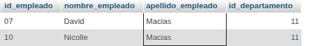
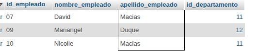
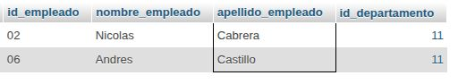
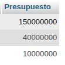
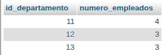
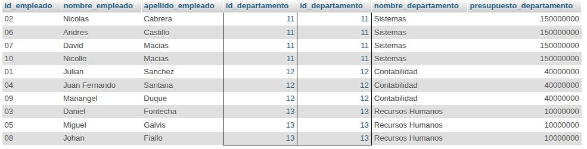
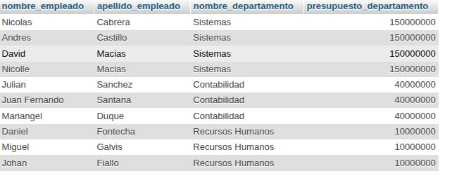
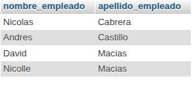

# consultas2_sql-

## MODELO FISICO

## ESTRUCTURA BD

## CONSULTAS

1. Obtener la lista de los apellidos de todos los empleados.
`SELECT apellido_empleado FROM Empleado;`

2. Obtener los apellidos de todos los empleados sin repeticiones.
`SELECT DISTINCT apellido_empleado FROM Empleado;`

3. Obtener todos los datos de los empleados que se apellidan 'Macias'.
`SELECT * FROM Empleado WHERE apellido_empleado = "Macias";`

4. Obtener todos los datos de los empleados que se apellidan "Diaz" y los que se apellidan "Rodriguez".  Usar OR o IN
`SELECT * FROM Empleado WHERE apellido_empleado LIKE "Macias" OR apellido_empleado LIKE "DUQUE";`

5. Obtener los nombres de los empleados que trabajan en el departamento 11
`SELECT nombre_empleado FROM Empleado WHERE id_departamento LIKE 11;`

6. Obtener todos los datos de los empleados cuyo apellido empiece por 'P'
`SELECT * FROM Empleado WHERE apellido_empleado LIKE "C%";`

7. Obtener el presupuesto total de todos los departamentos.

`SELECT (presupuesto_departamento) AS Presupuesto FROM Departamento;`

8. Obtener el número de empleados de cada departamento.

`SELECT id_departamento, COUNT(*) AS numero_empleados FROM Empleado GROUP BY id_departamento`

9. Obtener un listado completo de empleados, incluyendo por cada empleado los datos del empleado y de su departamento.

`SELECT * FROM Empleado, Departamento WHERE Empleado.id_departamento = Departamento.id_departamento;`

10. Obtener un listado completo de empleados, incluyendo el nombre y apellidos del empleado junto al nombre y presupuesto de su departamento.

`SELECT nombre_empleado, apellido_empleado, nombre_departamento, presupuesto_departamento FROM Empleado , Departamento WHERE Empleado.id_departamento = Departamento.id_departamento;`

11. Obtener los nombres y apellidos de los empleados que trabajen en departamentos cuyo presupuesto sea mayor a 100000000

`SELECT nombre_empleado , apellidos_empleado FROM empleado , departamento WHERE empleado.id_departamento = departamento.id_departamento AND presupuesto_departamento > 100000000;`

