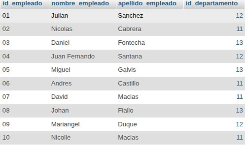
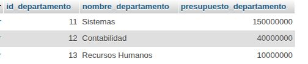
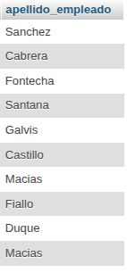
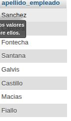

# consultas2_sql-

## MODELO FISICO

## ESTRUCTURA BD

## CONSULTAS

1. Obtener la lista de los apellidos de todos los empleados.
`SELECT apellido_empleado FROM Empleado;`

2. Obtener los apellidos de todos los empleados sin repeticiones.
`SELECT DISTINCT apellido_empleado FROM Empleado;`

